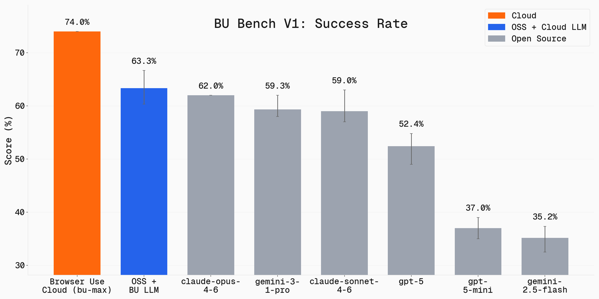

<!-- mcp-name: com.browser-use/browser-use -->
<picture>
  <source media="(prefers-color-scheme: light)" srcset="https://github.com/user-attachments/assets/2ccdb752-22fb-41c7-8948-857fc1ad7e24">
  <source media="(prefers-color-scheme: dark)" srcset="https://github.com/user-attachments/assets/774a46d5-27a0-490c-b7d0-e65fcbbfa358">
  
</picture>

<div align="center">
    <picture>
    <source media="(prefers-color-scheme: light)" srcset="https://github.com/user-attachments/assets/9955dda9-ede3-4971-8ee0-91cbc3850125">
    <source media="(prefers-color-scheme: dark)" srcset="https://github.com/user-attachments/assets/6797d09b-8ac3-4cb9-ba07-b289e080765a">
    
    </picture>
</div>

<div align="center">
<a href="https://cloud.browser-use.com?utm_source=github&utm_medium=readme-badge-downloads"></a>
</div>

---

<div align="center">
<a href="#what-can-browser-use-do"></a>

<a href="https://docs.browser-use.com"></a>

<a href="https://browser-use.com/posts"></a>

<a href="https://browsermerch.com"></a>

<a href="https://github.com/browser-use/browser-use"></a>

<a href="https://x.com/intent/user?screen_name=browser_use"></a>

<a href="https://link.browser-use.com/discord"></a>

<a href="https://cloud.browser-use.com?utm_source=github&utm_medium=readme-badge-cloud"></a>
</div>

</br>

# What can Browser Use do?

Browser Use lets an AI agent use a web browser the same way you do — it opens pages, clicks buttons, types, and fills in forms. You describe the task, and it completes it. For example, you can have it:


### 📋 Fill Forms
#### Task: "Fill in this job application with my resume and information."


[Example code ↗](https://github.com/browser-use/browser-use/blob/main/examples/use-cases/apply_to_job.py)


### 🍎 Extract data
#### Task: "Extract structured data about my followers and export it as a CSV."

https://github.com/user-attachments/assets/93714c75-98f4-4cfc-add1-69c38b5138b5

[Browser Use Cloud Docs ↗](https://docs.browser-use.com/cloud/quickstart)


### 💻 QA Automation
#### Task: "QA test my local website and report any bugs, usability issues, and visual inconsistencies."


[Browser Use CLI ↗](https://docs.browser-use.com/open-source/browser-use-cli)


<br/>

# Quickstart

If you want to use Browser Use in your agent (Claude Code, Codex, Cursor, Hermes, OpenClaw, etc.), paste this prompt, and it sets everything up itself:

```text
Install or upgrade browser-use to the latest stable version with uv using Python 3.12, run `browser-use skill install` to register the skill, and connect it to my browser. If setup or connection fails, follow https://github.com/browser-use/browser-harness/blob/main/install.md.
```

Then tell your agent what you want done.

<br/>

# Python library: the easiest way to automate the web

Want to automate the web at scale, from your own code, and with any LLM? Use the Python library:

**1. Install Browser Use (Python >= 3.11):**

```bash
uv add browser-use
# or: pip install browser-use
```

**2. Add your LLM API key to `.env`**. Get one from [Browser Use Cloud](https://cloud.browser-use.com/new-api-key?utm_source=github&utm_medium=readme-quickstart-api-key), or bring your own provider key:

```bash
# .env
BROWSER_USE_API_KEY=your-key
# GOOGLE_API_KEY=your-key
# ANTHROPIC_API_KEY=your-key
```

**3. Run your first agent:**

```python
import asyncio

from browser_use import Agent, ChatBrowserUse

async def main():
    agent = Agent(
        task="Find the number of stars of the browser-use repo",
        llm=ChatBrowserUse(model='openai/gpt-5.5'),
        # llm=ChatBrowserUse(model='bu-2-0'),  # Browser Use's optimized model
        # llm=ChatOpenAI(model='gpt-5.5'),
        # llm=ChatAnthropic(model='claude-opus-4-8'),  # Sonnet also works well
    )
    history = await agent.run()

if __name__ == "__main__":
    asyncio.run(main())
```

Check out the [library docs](https://docs.browser-use.com/open-source/introduction) and the [cloud docs](https://docs.cloud.browser-use.com?utm_source=github&utm_medium=readme-cloud-docs) for more!

<br/>

# Open Source vs Cloud

<picture>
  <source media="(prefers-color-scheme: light)" srcset="static/accuracy_by_model_light.png">
  <source media="(prefers-color-scheme: dark)" srcset="static/accuracy_by_model_dark.png">
  
</picture>

We benchmark Browser Use across 100 real-world browser tasks. Full benchmark is open source: **[browser-use/benchmark](https://github.com/browser-use/benchmark)**.

Browser Use is also **#1 on the [Odysseys leaderboard](https://odysseysbench.com/leaderboard)** with an 87.4% average, ahead of computer-use agents from OpenAI, Anthropic, Google, and Microsoft. Odysseys measures the agent's performance on 200 long-horizon web tasks.

**Use the Open-Source Agent**
- Free, and runs on your own machine
- Deep code-level integration and control: pick your LLM, customize the agent's behavior
- We recommend pairing it with our [cloud browsers](https://docs.browser-use.com/open-source/customize/browser/remote) for leading stealth, proxy rotation, and scaling

**Use the [Fully-Hosted Cloud Agent](https://cloud.browser-use.com?utm_source=github&utm_medium=readme-hosted-agent) (recommended)**
- Much more powerful agent for complex tasks (see plot above)
- Easiest way to start and scale
- Best stealth with proxy rotation and captcha solving
- 1000+ integrations (Gmail, Slack, Notion, and more)
- Persistent filesystem and memory

<br/>

## Integrations, hosting, custom tools, MCP, and more on our [Docs ↗](https://docs.browser-use.com)

<br/>

# FAQ

<details>
<summary><b>Should I use the CLI vs. the Python library?</b></summary>

**Use the CLI** if you already have an agent (Claude Code, Codex, Cursor, Hermes, OpenClaw, etc.) that you want to complete browser tasks for you. The agent installs the skill once (see [Quickstart](#quickstart)) and can then control the browser. Examples:
- "Upload this video to YouTube"
- "Compare these three laptops and give me a table with prices"
- "Fill in this job application with my resume"

**Use the Python library** when you are building software that automates the web. Examples:
- Run many tasks on a schedule or in parallel (scraping, monitoring, QA)
- Embed a browser agent into your own product
- Custom tools, custom system prompts, structured output, fine-grained browser control

Rule of thumb: one-off tasks through an agent → CLI. Repeatable automation in code → Python library.
</details>

<details>
<summary><b>What's the best model to use?</b></summary>

We optimized **ChatBrowserUse()** specifically for browser automation tasks. On avg it completes tasks 3-5x faster than other models with SOTA accuracy.

For pricing and other LLM providers, see our [supported models documentation](https://docs.browser-use.com/supported-models).
</details>

<details>
<summary><b>Can I use Claude / GPT / Gemini through ChatBrowserUse?</b></summary>

Yes. `ChatBrowserUse` accepts provider-prefixed model ids, so a single `BROWSER_USE_API_KEY` reaches all of them — no separate OpenAI/Anthropic/Google keys required:

```python
from browser_use import Agent, ChatBrowserUse

llm = ChatBrowserUse(model='anthropic/claude-sonnet-4-6')  # or 'openai/gpt-5.5', 'google/gemini-3-pro'
agent = Agent(task='...', llm=llm)
```

For the best speed and cost we still recommend the default `bu-*` models.
</details>

<details>
<summary><b>Should I use the Browser Use system prompt with the open-source preview model?</b></summary>

Yes. If you use `ChatBrowserUse(model='browser-use/bu-30b-a3b-preview')` with a normal `Agent(...)`, Browser Use still sends its default agent system prompt for you.

You do **not** need to add a separate custom "Browser Use system message" just because you switched to the open-source preview model. Only use `extend_system_message` or `override_system_message` when you intentionally want to customize the default behavior for your task.

If you want the best default speed/accuracy, we still recommend the newer hosted `bu-*` models. If you want the open-source preview model, the setup stays the same apart from the `model=` value.
</details>

<details>
<summary><b>Can I use custom tools with the agent?</b></summary>

Yes! You can add custom tools to extend the agent's capabilities:

```python
from browser_use import Tools

tools = Tools()

@tools.action(description='Description of what this tool does.')
def custom_tool(param: str) -> str:
    return f"Result: {param}"

agent = Agent(
    task="Your task",
    llm=llm,
    browser=browser,
    tools=tools,
)
```

</details>

<details>
<summary><b>Can I use this for free?</b></summary>

Yes! Browser-Use is open source and free to use. You only need to choose an LLM provider (like OpenAI, Google, ChatBrowserUse, or run local models with Ollama).
</details>

<details>
<summary><b>Terms of Service</b></summary>

This open-source library is licensed under the MIT License. For Browser Use services & data policy, see our [Terms of Service](https://browser-use.com/legal/terms-of-service) and [Privacy Policy](https://browser-use.com/privacy/).
</details>

<details>
<summary><b>How do I handle authentication?</b></summary>

Check out our authentication examples:
- [Using real browser profiles](https://github.com/browser-use/browser-use/blob/main/examples/browser/real_browser.py) - Reuse your existing Chrome profile with saved logins
- If you want to use temporary accounts with inbox, choose AgentMail
- To sync your auth profile with the remote browser, run `curl -fsSL https://browser-use.com/profile.sh | BROWSER_USE_API_KEY=XXXX sh` (replace XXXX with your API key)

These examples show how to maintain sessions and handle authentication seamlessly.
</details>

<details>
<summary><b>How do I solve CAPTCHAs?</b></summary>

For CAPTCHA handling, you need better browser fingerprinting and proxies. Use [Browser Use Cloud](https://cloud.browser-use.com?utm_source=github&utm_medium=readme-faq-captcha) which provides stealth browsers designed to avoid detection and CAPTCHA challenges.
</details>

<details>
<summary><b>How do I go into production?</b></summary>

Chrome can consume a lot of memory, and running many agents in parallel can be tricky to manage.

For production use cases, use our [Browser Use Cloud API](https://cloud.browser-use.com?utm_source=github&utm_medium=readme-faq-production) which handles:
- Scalable browser infrastructure
- Memory management
- Proxy rotation
- Stealth browser fingerprinting
- High-performance parallel execution
</details>

<br/>

## Citation

If you use Browser Use in your research or project, please cite:

```bibtex
@software{browser_use2024,
  author = {Müller, Magnus and Žunič, Gregor},
  title = {Browser Use: Enable AI to control your browser},
  year = {2024},
  publisher = {GitHub},
  url = {https://github.com/browser-use/browser-use}
}
```

<br/>

<div align="center">

**Tell your computer what to do, and it gets it done.**


[](https://x.com/intent/user?screen_name=mamagnus00)
&emsp;&emsp;&emsp;
[](https://x.com/intent/user?screen_name=gregpr07)

</div>

<div align="center"> Made with ❤️ in Zurich and San Francisco </div>
